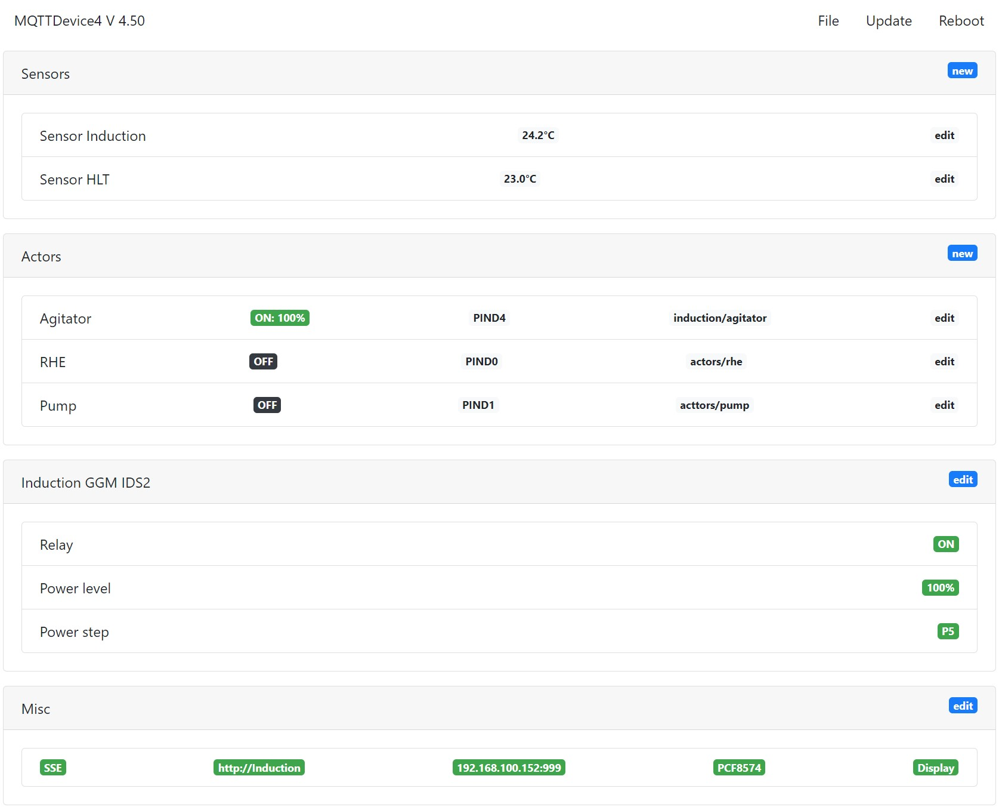
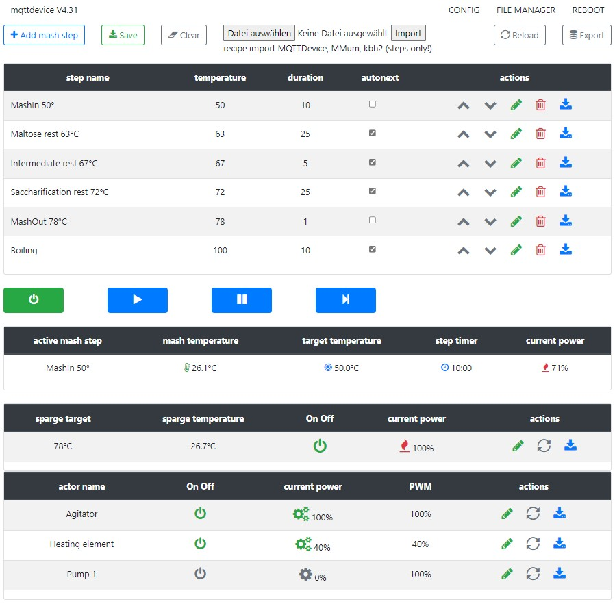

# MQTTDevice4

MQTTDevice4 enables sensors, actors and an induction hob to be connected via WLAN to [CraftBeerPi V4](https://github.com/avollkopf/craftbeerpi4).

MQTTDevice4 is an Arduino sketch for the ESP8266 Wemos D1 mini modules. This makes it possible to establish communication between the MQTT broker (eg mosquitto) and an ESP8266 in order to control sensors and actors with CraftBeerPi V4.

Brewing without CraftbeerPi as simpel as possible. *NEW*

## MQTTDevice2 or MQTTDevice4?

MQTTDevice2 (firmware versions 2.5x and earlier) was developed using CraftbeerPi version 3. MQTTDevice4 (firmware version 4.x and above) is CraftbeerPi 4 optimzed.

## Documentation

A detailed documentation is available on github pages: <https://innuendopi.github.io/MQTTDevice4/>
A detailed documentation CraftbeerPi4 is available on github pages:: <https://openbrewing.gitbook.io/craftbeerpi4_support/>

## Sketch Information

Libraries: Version 4.31, 09.2022

- ESP8266 3.0.2 (LittleFS)
- Arduino IDE 1.8.19
- Visual Code + modified ESP8266FS Plugin (VSCode 1.71 + Arduino for Visual Code 4.12)
- PubSubClient 2.8.0 (PubSubClient.h: #define MQTT_MAX_PACKET_SIZE 512)
- ArduinoJSON 6.19.4
- WiFiManager 2.0.12
- NextionX2 1.1.2 (NextionX2.h: #define ATTRIBUTE_TEXT_LENGTH 90, added currentPageID, lastPageID)
- PID_V2
- sTune
- PCF8574 0.3.5

Board configuration:
Flash size 4MB (FS:2MB OTA:~1019kB)
SSL support all SSL ciphers (most comp)
Exceptions Disabled
IwIP variant v2 lower mem

Debug output:
debug port must be set to serial. Set debug level accordingly to needed debug outputs (default none).
