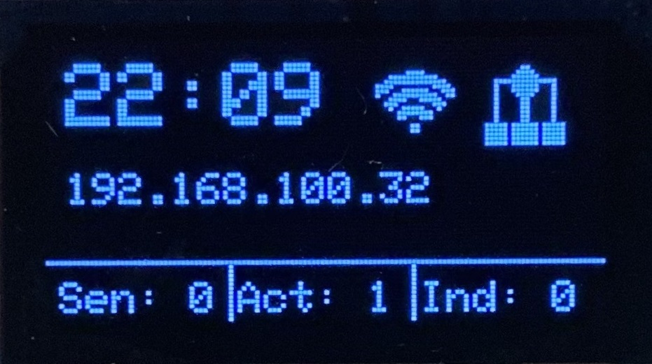
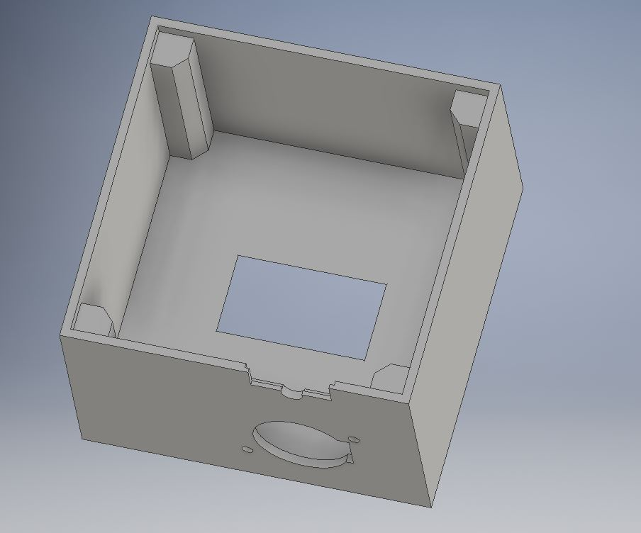
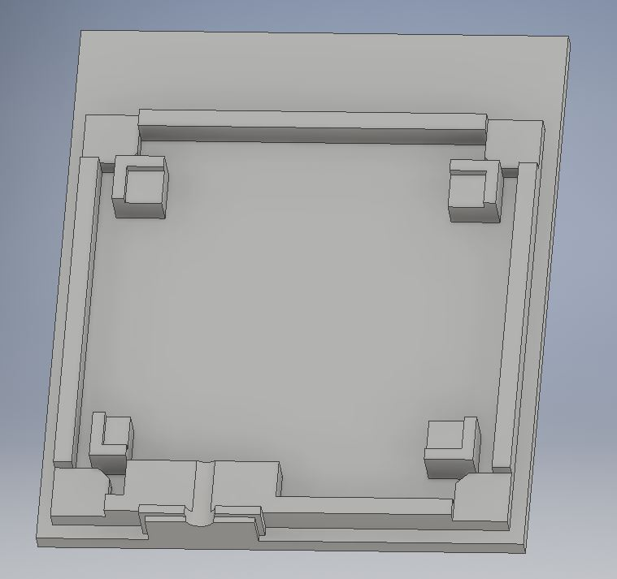

# MQTTDevice Version 2

**Was ist ein MQTTDevice?**

MQTTDevice4 is an Arduino sketch for the ESP8266 Wemos D1 mini modules. This makes it possible to establish communication between the MQTT broker mosquitto and an ESP8266 in order to control sensors and actors with CraftBeerPi V4. MQTTDevice is optimzed for version 4 of craftbeerpi

**What does this firmware offer?**

* A web interface (WebIf) for the configuration
* Sensors (max 6)
  * Search for connected sensors based on OneWire addresses
  * The reading interval of the sensor data and the offset are configurable (in seconds)
* Actors (max 8)
  * PIN selection (GPIO)
  * PINs in use are hidden
  * Inverted GPIO
  * Power Percentage: Values ​​between 0 and 100% are sent. The ESP8266 "pulses" with a cycle of 1000ms
* Induction hob
  * the induction hob GGM IDS2 can be controlled directly
* OLED display integration
* WebUpdate firmware
* mDNS support
* Update firmware and LittleFS via file upload
* Event handling
* File explorer

This project was started in the hobbybrauer forum and serves the exchange of information.
Forum: <https://hobbybrauer.de/forum/viewtopic.php?f=58&t=23509>

---

## Installation

The installation is divided into three steps:

1. Installation of RaspberryPi and CraftbeerPi3
2. Installation plug-in for CraftbeerPi3
3. Installation of MQTTDevice

The installation and configuration of CraftbeerPi4 is described here: <https://openbrewing.gitbook.io/craftbeerpi4_support/master/server-installation>

The installation and configuration of RaspberryPi is available in many good instructions on the internet.

The communication between CraftbeerPi and MQTTDevice takes place via WLAN. Sensors send temperature values ​​to CraftbeerPi and CraftbeerPi sends commands (e.g. switch agitator on / off) to actuators. The MQTT protocol is used for this communication. The MQTT protocol requires a central exchange: an MQTT broker.

**MQTT CraftbeerPi4:**

Preparation on the RaspberryPi: Installation of the MQTT Broker

`sudo apt-get install mosquitto`

This instruction installs the MQTT broker mosquitto on the RaspberryPi. The MQTT Broker serves as the central switching point between CraftbeerPi4 and MQTTDevices. CraftbeerPi4 can receive data from sensors via the MQTT protocol and send instructions to actors.

CraftbeerPi3 muss nun einmal neu gestartet werden. Anschließend steht der Typ MQTT für Sensoren und Aktoren zur Verfügung

MQTT kommuniziert mit Topics. Jeder Sensor und jeder Aktor bekommt sein eigenes Topic für die Kommunikation.
Auf den Bildern dargestellt ist ein CraftbeerPi3 Temperatur Sensor mit dem Namen Temp Induktion. CraftbeerPi3 liest Sensordaten aus dem Topic "induktion/temperatur".

Analog zum Sensor sendet CraftbeerPi Befehle an den Aktor Rührwerk in das Topic "induktion/ruehrwerk".

Diese zwei Topics werden nun beispielhaft auf dem MQTTDevice eingerichtet.

*Hinweis 1: falls ein CraftbeerPi3 MQTT Plugin bereits vorhanden ist (bspw. die ältere Version cbpi-mqttCompressor), muss das Plugin ersetzt werden. Dazu die Version cbpi-mqttPub in den Plugins Ordner kopieren und den Ordner cbpi-mqttCompressor löschen.*

*Hinweis 2: wenn das Induktionskochfeld GGM IDS2 eingesetzt wird, sollte das CraftbberPi3 Plugin cbpi-PIDArduinoPowerOutput verwendet werden: <https://github.com/InnuendoPi/cbpi-PIDArduinoPowerOutput>*
*Zur Konfiguration der PID Einstellungen ist das Plugin cbpi-PIDAutoTunePowerOutput <https://github.com/InnuendoPi/cbpi_PIDAutoTunePowerOutput> sehr hilfreich*

**MQTTDevice flashen:**

Mit Hilfe von esptool.exe (<https://github.com/igrr/esptool-ck/releases> ) aus dem Ordner tools kann die Firmware auf das ESP Modul geladen werden. Das ESPTool ist für verschiedene Betriebssysteme verfügbar.
ESPtool-ck Copyright (C) 2014 Christian Klippel ck@atelier-klippel.de. This code is licensed under GPL v2.

Unter Win10 wird der USB Treiber CH341SER benötigt: <http://www.wch.cn/download/CH341SER_ZIP.html>

Beispiel für ein ESP8266 Modul vom Typ Wemos D1 mini mit 4MB Flash verbunden mit COM3

* Von github das Archiv Firmware.zip aus dem Ordner Tools herunterladen und irgendeinem Ordner entpacken

  * Das Archiv enthält das esptool zum Flashen, das Skript Flashen.cmd und die zwei Firmware Dateien

  * Doppelklick auf die Datei Flashen.cmd.

  Die Firmware wird nun auf das MQTTDevice aufgespielt.

  *Das Skript Flashen verwendet COM3 als Anschluss für das MQTTDevice. Sollte COM3 nicht der richtige Anschluss für den Wemos D1 mini sein, muss im Skript Flashen.cmd an zwei Stellen COM3 durch den richtigen Anschluss ersetzt werden.*

  Nach dem Flashen startet das MQTTDevice im Access Point Modus mit dem Namen "ESP8266-xxxx" und der Adresse <http://192.168.4.1>

  

  Das MQTTDevice muss nun mit dem WLAN verbunden werden und die IP Adresse vom MQTT Broker muss eingetragen werden. In diesem Beispiel wurde der MQTT Broker mosquitto auf dem RaspberryPi installiert. Es ist also die IP Adresse vom RaspberryPi (CraftbeerPi) einzugeben.

Der MQTT Sensor "Temp Induktion" und der MQTT Aktor "Rührwerk" werden nun auf dem MQTTDevice mit den identischen Topics angelegt:

Der Sensor- oder Aktorname darf unterschiedlich sein. Mit diesen Schritten ist die beispielhafte Installation und Konfiguration von MQTT Sensoren und Aktoren abgeschlossen. Es können je MQTTDevice bis zu 6 Sensoren und 6 Aktoren eingerichtet werden. Es können (nahezu) beliebig viele MQTTDevices mit CraftbeerPi über MQTT verbunden werden. Sehr häufig werden zwei MQTTDevices verwendet:

MQTTDevice 1: Sud & Maische Kessel mit Temperatursensoren und Aktoren für Induktionskochfeld und Rührwerk

MQTTDevice 2: Nachguss und Pumpen mit Temperatursensoren und Aktoren für Heater, Pumpen, Heizstäbe, Ringheizelemente etc.

Es sind beliebige Kombinationen möglich. Weil die Kommunikation MQTT über Topics realisiert ist, muss bspw. ein Temperatursensor und ein Induktionskochfeld für ein CraftbeerPi Kettle nicht am gleichen MQTTDeivce konfiguriert sein.

**Updates:**

Die Firmware bietet zwei Möglichkeiten, um Updates sehr einfach einspielen zu können.

1. Update durch Dateiupload

    Im Webbrowser die URL <http://mqttdevice/update> aufrufen oder im WebIf den Button "Update" -> "Upload" verwenden.
    Hier kann Firmware und das Filesystem SPIFFS aktualisiert werden. Wenn das Filesystem SPIFFS mit Dateiupload aktualisiert wird, wird die Konfigurationsdatei überschrieben. Siehe Backup und Restore.

2. WebUpdate

    Im Webbrowser die URL <http://mqttdevice> aufrufen und die Funktion "Update" -> "WebUpdate" aufrufen.
    WebUpdate aktualisiert die Firmware, die index Datei und Zertifikate. Durch WebUpdate wird die Konfigurationsdatei nicht überschrieben.

Das WebUpdate kann je nach Internetverbindung ein paar Minuten dauern. Während des WebUpdates steht das Web Interface nicht zur Verfügung. Wenn nur eine sehr langsame Internetanbindung zur Verfügung steht, wird nach ca. 60 Sekunden die Meldung "Browser reagiert nicht" angezeigt. Bitte warten und das WebUpdate durchlaufen lassen.

**Backup and Restore der Konfiguration:**

Der Dateiexplorer ist erreichbar über den Webbrowser <http://mqttdevice/edit>

1. Backup

    Auf die Datei config.txt klicken (li Mouse Taste) und aus dem PopUp Download auswählen.

2. Restore

    Auf Datei auswählen klicken, die config.txt aus dem Backup auswählen und Upload anklicken

**Unterstützte und getestete Hardware:**

Getestete Hardware Stand 09.2020

| Anzahl | Link |
| ------------ | ---- |
| ESP8266 D1 Mini | <https://www.amazon.de/dp/B01N9RXGHY/ref=cm_sw_em_r_mt_dp_0KzyFbK6YG2BE> |
| Relais Board 4 Kanal | <https://www.amazon.de/dp/B078Q8S9S9/ref=cm_sw_em_r_mt_dp_PHzyFbSR1PKCH> |
| Relais Board 1 Kanal | <https://www.amazon.de/dp/B07CNR7K9B/ref=cm_sw_em_r_mt_dp_FIzyFbKXXYE0H> |
| OLED Display 1.3" | <https://www.amazon.de/dp/B078J78R45/ref=cm_sw_em_r_mt_dp_5FzyFbS1ABDDM> |
| Piezo Buzzer | <https://www.amazon.de/dp/B07DPR4BTN/ref=cm_sw_em_r_mt_dp_aKzyFbJ0ZVK67> |

*Die Links zu amazon sind rein informativ als Suchhilfe*
*für allgemein bekannte Anbieter zu verstehen*

---

## Verwenden der Firmware

Die meisten Funktionen der Firmware sind selbsterklärend. Das Hinzufügen oder das Löschen von Sensoren und Aktoren wird daher hier nicht beschrieben.

**Die Hauptfunktionen:**

    * Hinzufügen, editieren und löschen von Sensoren
    * Auto reconnect MQTT
    * Auto reconnect WLAN
    * OLED Display optional konfigurieren
    * System Einstellungen vollständig veränderbar
    * Firmware und SPIFFS Updates über Dateiupload
    * Firmware WebUpdate
    * Filebrowser für einefaches Datei-Management (zB backup und restore config.json)
    * DS18B20 Temperatur Offset - einfaches kalibrieren der Sensoren

**Das Menü Enstellungen:**

1. System

    **IP Adresse MQTT Server (CBPi):**

    Unter System wird der MQTT Broker eingetragen. In den allermeisten Fällen dürfte dies mosquitto auf dem CBPi sein.
    Wichtig: die Firmware MQTTDevice versucht permanent, mit dem MQTT Broker eine Verbindung aufzubauen. Wenn der MQTT Broker nicht verfügbar ist, beeinträchtigt das sehr stark Geschwindigkeit vom MQTTDevice (Web-Interface).

    **Piezo Buzzer:**

    Ein Piezo Buzzer kann nur an PIN D8 angeschlossen werden. Ein Piezo Buzzer ist optional. Die Firmware unterstützt 4 verschiedene Signale: ON, OFF, OK und ERROR

    **mDNS:**

    Ein mDNS Name kann anstelle der IP Adresse vom ESP8266 im Webbrowser verwendet werden (<http://mDNSname>). Der Name ist frei wählbar. Der mDNS Name muss im Netzwerk eindeutig sein und darf keine Leer- oder Sonderzeichen enthalten.

    **Grafana Einstellungen**

    Die Anbindung an Grafana, um einen Brautag graphisch darzustellen, ist optional. Die Eingabefelder sind selbsterklärend. Wird Grafana über die Checkbox aktiviert, benötigt das MQTTDevice zwingend einen Reboot.

    Zur Konfiguration siehe Rubrik Visualisierung.

2. Intervalle

    Unter Intervalle werden die Zeitabstände konfiguriert, mit denen festgelegt wird
    * wie häufig Sensoren abgefragt werden und die Daten zum CBPi gesendet werden
    * wie häufig Befehle für Aktoren / Induktion vom CBPi abgeholt werden

    Mit diesen Intervallen kann die Performance vom Wemos verbessert werden. Die Standard Einstellung von 5 Sekunden für Umgebungen mit wenigen Sensoren und Aktoren geeignet. In Umgebungen mit vielen Sensoren und Aktoren wäre ein Intervall von 10 bis 30 Sekunden für den kleinen Wemos besser geeignet. Dies muss individuell ausprobiert werden.  

3. Der Eventmanager

    Der Eventmanager behandelt Ereignisse und Fehlverhalten. Das Behandeln von Fehlverhalten (Event handling) ist in der Standard Einstellung deaktiviert!

    Was soll das MQTTDevice machen, wenn
    * die WLAN Verbindung verloren geht
    * der Kommunikation mit dem MQTT Server unterbrochen wird
    * in Sensor plötzlich keine Temperaturdaten liefert

    Ohne das Event handling macht der Wemos nichts automatisert. Der Zustand verbleibt unverändert.

    Es gibt 4 Grundtypen von Ereignissen (Events), die automatisiert behandelt werden können: für Aktoren und für das Induktionkochfeld bei Sensorfehlern, sowie für Aktoren und das Induktionskochfeld bei WLAN und bei MQTT Fehlern. Für diese 4 Typen werden Verzögerungen für das Event handling konfiguriert. Während der Verzögerung verbleibt der Zustand unverändert. Nach der Verzögerung kann das MQTTDevice den Zustand von Aktoren und Induktionskochfeld ändern.
    Die Verzögerungen werden unter Einstellungen -> EventManager konfiguriert:

    1. Verzögerung für Aktoren bevor ein Sensor ein Event auslöst.
    2. Verzögerung für das Induktionskochfeld bevor ein Sensor ein Event auslöst.
    3. Verzögerung bei MQTT Fehlern.
    4. Verzögerung bei WLAN Fehlern.

    Die Standard Verzögerung für diese 4 Ereignisse beträgt 120 Sekunden.

    Das WLAN und MQTT Event handling kann grundsätzlich aktiviert oder für alle Aktoren und Induktionskochfeld deaktiviert werden. Wird das WLAN und MQTT Event handling aktiviert, muss in den Einstellungen der Aktoren und für das Induktionskochfeld zusätzlich das Event handling aktiviert werden. So kann jedes Gerät individuell konfiguriert werden.

    Auch jeder Sensor hat eine Eigenschaft Event handling. Wird für einen Sensor das Event handling aktiviert, so kann dieser Sensor bei einer Sensorstörung die Event Behandlung auslösen. Ein Sensor, der für das Event handling deaktiviert ist, kann dementsprechend keine Event Behandlung auslösen.

    Die Szenarien für die Verwendung vom Event handling sind sehr vielfältig. Hier sind jeweils die Funktionen von Sensoren und Aktoren individuell zu unterscheiden. Zwei Beispiele zur Erläuterung:

    **Beispiel 1:**
    Wenn der MQTT Broker unerwartet die Verbindung beendet, dann
    1. wird automatisch versucht die Verbindung wieder aufzubauen, völlig unabhängig von den Einstellungen Event handling.
    2. die konfigurierte Verzögerung wird abgewartet, bevor ein Aktor automatisch ausgeschaltet wird
    3. das Induktionsfeld kann auf eine niedrigere Leistung gesetzt werden (von 100% auf 20%), um die Temperatur zu halten

    **Beispiel 2:**
    Wenn ein Temeratursensor beim Brauen einen Fehler meldet, bspw. der Stecker löst sich und der Sensor meldet "Unplugged", dann
    1. wird automatisch versucht, in den nächsten Zyklen brauchbare Messwerte vom Sensor zu erhalten.
    2. die konfigurierte Verzögerung wird abgewartet.
    3. nach Ablauf der Verzögerung kann ein Aktor Rührwerk am Sudkessel weiterlaufen: das Event handling für diesen Aktor ist deaktiviert.
    4. ein Aktor Heater (verbunden mit einem SSR) kann abgeschaltet werden: das Event handling für diesen Aktor ist aktiviert.
    5. ein Aktor Pumpe kann abgeschaltet werden: das Event handling für den Aktor Pumpe ist aktiviert.

    Beispiel 2 bei komplett deaktiviertem Event handling würde bedeuten, dass CBPi an den Aktor Heater 100% Leistung zum Aufheizen sendet.  

    Die Reihenfolge beim Event handling ist grundsätzlich
    * WLAN Fehler
    * MQTT Fehler
    * Sensor Fehler

    Rückwärts betrachtet kann das Event Sensor Fehler nur dann eintreten, wenn die Kommunikation mit dem MQTT Broker fehlerfrei ist. Ein Event MQTT Fehler kann nur ausgelöst werden, wenn eine WLAN Verbindung hergestellt ist.

4. Restore

    Über das Menü Restore kann der Wemos gelöscht werden. Zur Auswahl stehen
    * WLAN Einstellungen löschen
    * Alle Einstellungen löschen (WLAN und Konfiguration)

---

**Das OLED Display:**

Diese Firmware unterstützt OLED Display monochrom 128x64 I2C 1.3" SH1106 und mit einer kleinen Anpassung am Quellcode das OLED Display monochrom 128x64 I2C 0.96" SSD1306.

Das Display kann über das WebIf konfiguriert werden. Wenn das Display aktiviert wird, sind die PINS D1 (SDL) und D2 (SDA) belegt. Auf dem Display werden Sensoren, Aktoren und Induktion mit ihren aktuellen Werten dargestellt.
Dabei bedeutet "S1 78 | A2 100 | I off"

* Sensor 1 meldet eine Temperatur von 78°C
* Aktor 2 hat einen Powerlevel von 100%
* Induktion ist ausgeschaltet (oder nicht konfiguriert)

Mit jeder Aktualisierung Display wandert die Anzeige auf den nächsten Sensor bzw. Aktor. Im Beispiel wäre das S2 und A3.

Anschluss ESP8266 D1 Mini an ein AZ-Delivery 1.3" i2c 128x64 OLED Display (Verwendung aller Information auf eigene Gefahr!)

* VCC -> 3.3V
* GND -> GND
* SCL -> D1
* SDA -> D2

Benötigte Bibliothek für das OLED 1.3 SH1106:

Die folgende Bibliothek muss heruntergeladen und in das libraries Verzeichnis kopiert werden:
<https://github.com/InnuendoPi/Adafruit_SH1106>

Anpassungen für OLED Display mit SSD1306 Chip:

Anschließend müssen im Quellcode die Stellen SH1106 in SSD1306 geändert werden. Die entsprechenden Stellen enthalten bereits Anmerkungen: MQTTDevice2.ino 5_DISPLAY.ino und CONFIGFILE.ino

---

## Die MQTTDevice Platine

**Wichtiger Hinweis:**

Die Platine ist aus einem Hobby-Projekt entstanden. Eine fertig bestückte Platine wird nicht angeboten. Das Projekt verfolgt keinerlei kommerzielle Absichten. Die hier geteilten Informationen stellen einen Entwicklungszustand dar und dienen der Weiterentwicklung sowie der Überprüfung, Korrektur und Verbesserung. Inhalte aus externen Links (bspw Forum hobbybrauer) und Angaben zu externen Inhalten (bspw. Artikel allgemein bekannter Anbieter) unterliegen den jeweiligen Rechten der Inhaber. Externe Inhalte sind ausschließlich als informative Starthilfe anzusehen.  

*Alle Informationen über die Platine sind rein informativ und können falsch sein.*
*Verwendung dieser Informationen auf eigene Gefahr. Jegliche Haftung wird ausgeschlossen.*

 

In diesem Projekt wurde eine Platine für das MQTTDevice entwickelt, um mit Klemmschraubblöcken eine einfache Anbindung an Sensoren, Aktoren und an das Induktionskochfeld GGM IDS2 zu bieten. Die Platine ist mit nur wenigen Bauteilen bestückt. Die Platine bietet folgende Vorteile:

* der Wemos D1 mini steckt auf einem Sockel und kann jederzeit abgenommen werden.
* alle GPIOs werden auf Schraubklemmen geführt.
* ein LevelShifter sorgt für 5V Steuerspannung an den Schraubklemmen GPIOs (Logic Level Converter).
* die Stromversorgung vom Wemos kann bei der Verwendung einer GGM IDS2 direkt vom Induktionskochfeld genutzt werden.
* Temperatursensoren DS18B20 fest an D3 können direkt an die Schraubklemmen angeschlossen werden.
* ein optionales OLED Display kann über den Jumper J1 und J2 über D1 (SDL) und D2 (SDA J2) angebunden werden.
* PIN D4 kann wahlweise per Jumper J3 an den Display Port oder über den LevelShifter an D4 geführt werden.
* PIN D8 ist ohne LevelShifter auf D8 (3V3) geführt.
* Spannungsversorgung 5V über Schraubklemme

**Einstellung der Jumper:**

Auf der Platine befinden sich 4 Steckbrücken (Jumper)

1. Jumper J1: PIN D1
    1. In der Stellung 1-2 wird D1 zum Anschluss Display geführt (SDL)
    2. In der Stellung 2-3 wird D1 über den LevelShifter zum Anschluss D1 geführt

2. Jumper J2: PIN D2
    1. In der Stellung 1-2 wird D2 zum Anschluss Display geführt (SDA)
    2. In der Stellung 2-3 wird D2 über den LevelShifter zum Anschluss D2 geführt

3. Jumper J3: PIN D4
    1. In der Stellung 1-2 wird D4 zum Anschluss Display als D4 ggfs. für ein TFT geführt
    2. In der Stellung 2-3 wird D4 über den LevelShifter zum Anschluss D4 geführt

4. Jumper J4: 5V Stromanschluss von GGM IDS2
    1. Wenn der Jumper gebrückt ist, wird die Stromzufuhr 5V vom Induktionskochfeld (JST-HX Buchse) verwendet
    2. Wenn der Jumper nicht gesetzt ist, benötigt der Wemos eine Stromzuführ über den 5V Anschluss
    Jumper J4 ist optional. Wird die GGM IDS2 nicht verwendet, kann die Steckbrück und Anschlussbuchse entfallen.

    *Wenn die Stromversorgung vom Induktionskochfeld bezogen wird (Jumper J4 gesetzt), darf keine Spannungsversorgung zusätzlich über den 5V Eingang angeschlossen werden.*
    *GPIO0, GPIO2 und GPIO15 bilden den Boot Mode für den Wemos D1 Mini ab. GPIO15 ist nicht über den LevelShifter verbunden und muss für den Flash Boot Mode auf Low stehen. GPIO0 und GPIO2 sind beim Flash Boot auf High*

**Das Platine Layout:**

Im Ordner Info befindet sich eine EasyEDA Datei, mit deren Hilfe die Platine erstellt werden kann. Ebenfalls im Ordner Info befinden sich STL Dateien für einen 3D Druck MQTTDevice Gehäuse.
Korrekturen, Verbesserungen und Weiterentwicklungen bitte teilen.

**Platine Stückliste:**

Folgende Bautteile werden benötigt:

| Anzahl | Artikel | ArtikelNr |
| ------ | ------- | --------- |
| 1 | Schraubklemmblock 2pol Rastermaß 2,54 | (Bsp voelkner S84366) |
| 3 | Schraubklemmblock 3pol Rastermaß 2,54 | (Bsp voelkner S84893) |
| 2 | Schraubklemmblock 5pol Rastermaß 2,54 | (Bsp voelkner S84806) |
| 2 | Schraubklemmblock 8pol Rastermaß 2,54 | (Bsp voelkner S84611) |
| 1 | JST-HX Buchse gewinkelt Rastermaß 2,54 | (Bsp voelkner D17526) |
| 1 | Stiftleiste einreihig Rastermaß 2,54 | (Bsp voelkner D19990) |
| 4 | Steckbrücken (Jumper) Rastermaß 2,54 | (Bsp voelkner S655251) |
| 1 | Widerstand 4,7kOhm | (Bsp voelkner S620751) |
| 1 | D1 mini NodeMcu ESP8266-12E mit Sockel | (Bsp amazon ASIN B01N9RXGHY) |
| 1 | LevelShifter 8 Kanal 5V 3.3V | (Bsp amazon ASIN B01MZ76GN5) |

*amazon und voelkner sind rein informativ als Suchhilfe*
*für allgemein bekannter Anbieter zu verstehen*

Bei der Auswahl LevelShifter (Logic Level Converter) muss zwingend die Belgung beachtet werden. Der LevelShifter muss im Eingang Low Voltage (LV) diese Reihenfolge haben:

`LV1 - LV2 - LV3 - LV4 - LV (3V3) - Ground - LV5 - LV6 - LV7 - LV8`

**Platine Hinweise zum Aufbau:**

Der Widerstand R 4.7kOhm für die Temperatursensoren DS18B20 wird unter dem Wemos D1 mini platziert. Deshalb muss der Wemos gesockelt werden. Die Sockel bieten zudem den Vorteil, dass der Wemos jederzeit von der Platine genommen werden kann, bspw. zum Flashen oder zum Testen. Die DS18B20 werden an VCC mit 5V versorgt. Dies stellt eine stabile Versorgung auch bei längeren Zuleitungen sicher. Der Widerstand ist von Data (PIN D3) gegen 3V3.
Die JST-HX Buchse und die Steckbrücke J4 für das Induktionskochfeld sind optional.

## Anschluss Induktionskochfeld

*Die folgende Beschreibung löscht die Garantieansprüche für das Induktionskochfeld*
*Verwendung dieser Anleitung auf eigene Gefahr*

Das Induktionskochfeld vom Typ GGM IDS2 kann **optional** mit der Platine verbunden werden. Die GGM IDS2 wird mit einem externen Bedienteil geliefert. Wenn das Bedienteil geöffnet wird, kann die Kabelverbindung vom Bedienteil zum Induktionskochfeld entnommen werden. Dafür muss lediglich das Kabel aus der Buchse im Bedienteil abgezogen werden.
Die exakt gleiche Buchse (JST-HX) befindet sich auf der MQTTDevice Platine.

Die Anschlüsse müssen über das Web Interface wie folgt konfiguriert werden:

* Weiß (Relais) ist fest verbunden mit PIN D7
* Gelb (Command Channel) ist fest verbunden mit Pin D6
* Blau (Backchannel) ist fest verbunden mit Pin D5

Eine separate Stromversorgung ist für das MQTTDevice bei Verwendung der GGM IDS2 nicht erforderlich.

## Anschluss DS18B20

Es werden Temperatursensoren vom Typ DS18B20 mit 3 Anschlusskabeln (Data, VCC und GND) unterstützt. Temperatursensoren sind an D3 gebunden. Der notwendige Widerstand 4k7 gegen 3V3 ist auf der Platine vorgesehen. Die Spannungsversorgung der Temperatursensoren ist an 5V angebunden.

## Anschluss Relaisboards

Relaisboards benötigen neben einem GPIO eine 5V Spannungsversorgung. 5V können an einem der drei Anschlüsse für die Temperatursensoren DS18B20 an VCC und GND abgegriffen werden.

---

## Gehäuse

Die benötigten Dateien 3D Druck befinden sich im Ordner Info. Mit dem aktuellen Entwurf Gehäuse werden die Platine und das OLED Display in das Gehäuse verklebt.

Das Gehäuse ist mit Halteklammern zwischen Trägerplatte und Gehäusedeckel ausgestattet.

---
