# MQTTDevice Version 4

*What is MQTTDevice?**

MQTTDevice4 is an Arduino sketch for the ESP8266 Wemos D1 mini modules. MQTTDevice connects to a MQTT Broker in order to control sensors and actors with CraftBeerPi V4. Multiple MQTTDevices can be connected to a MQTT broker.  

*NEW*
Brewing without CraftbeerPi as simpel as possible.

An easy but reliable PID based mash controller without the hassle of setting up, configuring and updating a raspberrypi for CBPi4.

**What does this firmware offer?**

* A configuration web interface (WebIf)
* Temperature sensors DS18B20 (max 6)
  * Search for connected sensors based on OneWire addresses
* Actors (max 8)
  * PIN selection (GPIO)
  * PINs in use are hidden
  * Inverted GPIO
  * Power Percentage: Values ​​between 0 and 100% are sent. The ESP8266 "pulses" with a cycle of 1000ms
* Induction hob
  * the induction hob GGM IDS2 can be controlled directly
* Nextion Touchdisplay integration
* WebUpdate firmware
* mDNS support
* Update firmware and LittleFS via file upload
* Event handling
* File explorer
* Brew without CraftbeerPi4 (standalone) *NEW*

This project was started in the hobbybrauer forum and serves the exchange of information.
Forum: <https://hobbybrauer.de/forum/viewtopic.php?f=58&t=23509>

---

## Installation

The installation is divided into three steps:

1. Installation of RaspberryPi and CraftbeerPi4
2. Installation MQTT Broker
3. Installation MQTTDevice

The installation and configuration of CraftbeerPi4 is described here: <https://openbrewing.gitbook.io/craftbeerpi4_support/master/server-installation>
You will need version 4.0.1.11 or above. Earlier versions do not support MQTT actors.

The installation and configuration of RaspberryPi is available in many good instructions on the internet.

The communication between CraftbeerPi and MQTTDevice takes place via WLAN. Sensors send temperature values ​​to CraftbeerPi and CraftbeerPi sends commands to actors (e.g. switch agitator on / off). The MQTT protocol is used for this communication. The MQTT protocol requires a MQTT broker.

**MQTT in short:**

MQTT is a publish-and-subscribe protocol. Clients, devices and applications publish and subscribe into topics handled by a broker. In a CraftbeerPi environment a sensor is a publishing and an actor is a subscribing device. Devices or applications never communicate directly, instead they send and receive messages managed in topics by the MQTT broker. A topic looks like a named channel or folder, eg induction/temp or upstairs/bathroom/light. Hundreds of different topics are possible. Each topic behave like a message in- and outbox. Messages are send in a compact JSON format, also known as payloads. A simple payload from a sensor device can look like this: { "value": 21.2 }. The sensor publishes this message into a topic. All subscribed clients, devices or application to this topic will receive the sensor message "value 21.2". A simple payload from CraftbeerPi to an actor can be { "state": "on"}. CBPi4 publishes this message into a topic to switch on an actor. An actor must subcribe to this topics to receive this message.

MQTT summary:

* sensors are publishing payloads (sensor values) into topics
* actors subscribe to topics to receive payloads (commands)
* every published payload will always be sent to a MQTT broker
* the MQTT broker sends every received payload to all subscribing devices and applications
* craftbeerpi subscribes to all sensor topics and publishes actor commands in actor topics
* all sensor and actor topics are unique

**MQTT CraftbeerPi4:**

Preparation on the RaspberryPi: Installation of the MQTT Broker

`sudo apt-get install mosquitto`

This instruction installs the MQTT broker mosquitto on the RaspberryPi. The MQTT Broker serves as the central switching point between CraftbeerPi4 and MQTTDevices. CraftbeerPi4 can receive data from sensors via the MQTT protocol and send instructions to actors.

Method 1: allow anonymous access to MQTT broker: (not recommended)

`sudo nano /etc/mosquitto/mosquitto.conf`

Add these two line at the top of the configuration file:

`allow_anonymous true`
`port 1883`

Method 2: use basic authentication

Create a password file:

`cd /etc/mosquitto`
`sudo mosquitto_passwd -c passwdfile pi`

now enter your password twice

`sudo nano /etc/mosquitto/mosquitto.conf`

Add these three line at the top of the configuration file:

`allow_anonymous false`
`port 1883`
`password_file /etc/mosquitto/passwdfile`

You need to restart the broker service

`sudo systemctl stop mosquitto`
`sudo systemctl start mosquitto`

Now you need to configure your MQTT environment in your CraftbeerPi4 config files:

`nano config/config.yaml`

and check all MQTT parameters:

`mqtt: true`

`mqtt_host: localhost`

`mqtt_password: ''`

`mqtt_port: 1883`

`mqtt_username: ''`

After CBPi4 restart MQTT is available for sensors and actors

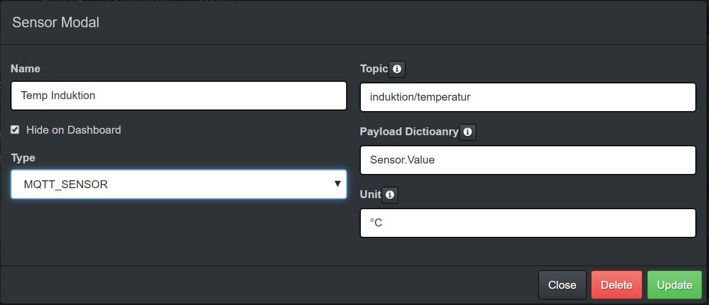

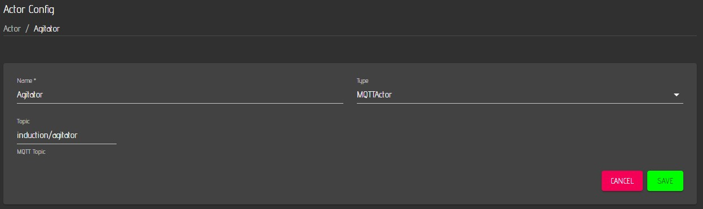

Please note the dot in PayloadDictionary: Sensor.Value (Sensor dot Value)

**MQTTDevice flash firmware:**

With the help of esptool.exe (<https://github.com/igrr/esptool-ck/releases>) in the github tools subfolder, the firmware can be flashed onto the ESP module. The ESPTool is available for different operating systems.
ESPtool-ck Copyright (C) 2014 Christian Klippel ck@atelier-klippel.de. This code is licensed under GPL v2.

The USB driver CH341SER is required under Win10: <http://www.wch.cn/download/CH341SER_ZIP.html>

Example for an ESP8266 module of the type Wemos D1 mini with 4MB Flash connected via USB as COM3

* Download the Firmware.zip archive from the tools folder on github and extract it to any folder

  * The archive contains the esptool for flashing, the Flashen.cmd script and the two firmware files

  * Double click on the file Flashen.cmd.

  The firmware is now installed on the MQTT device.

  *The Flash script uses COM3 as the connection for the MQTTDevice. If COM3 is not the correct port for the Wemos D1 mini, COM3 must be replaced by the correct port in two places in the Flashen.cmd script.*

  After flashing, the MQTT device starts in access point mode with the name "ESP8266-xxxx" und address <http://192.168.4.1>

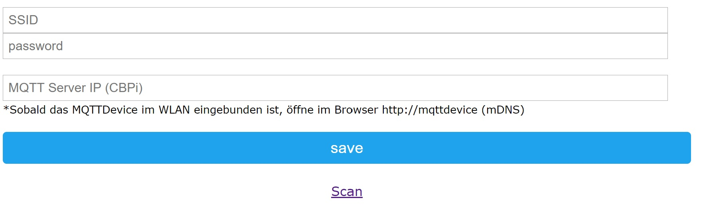

The MQTT device must now be connected to the WLAN.

The MQTT sensor "Induction temperature" and the MQTT actor "Agitator" are now created on the MQTTdevice with the identical CBPi4 topics:

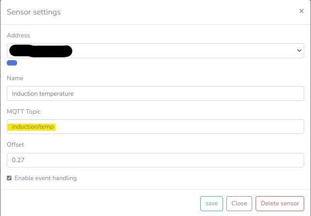

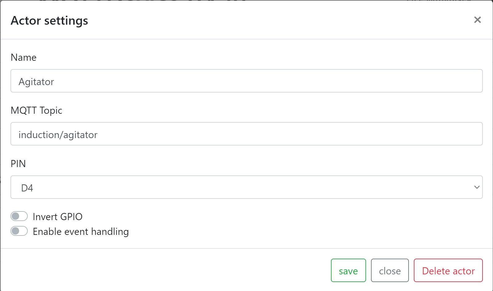

The sensor or actor name can be different. These steps complete the exemplary installation and configuration of MQTT sensors and actors. Up to 6 sensors and 8 actors can be set up per MQTT device. (Almost) any number of MQTT devices can be connected to CraftbeerPi via MQTT. Three MQTT devices are used very often:

MQTTDevice 1: Mash tun with temperature sensors and agitator.

MQTTDevice 2: HLT with temperature sensors, pumps and valves etc.

MQTTDevice 3: Fermenter with temperature sensors, an actor for heating and an actor for cooling

Any combination is possible. Because the MQTT communication is implemented via topics, a temperature sensor and an induction hob for a CraftbeerPi Kettle do not have to be configured on the same MQTTDeivce.

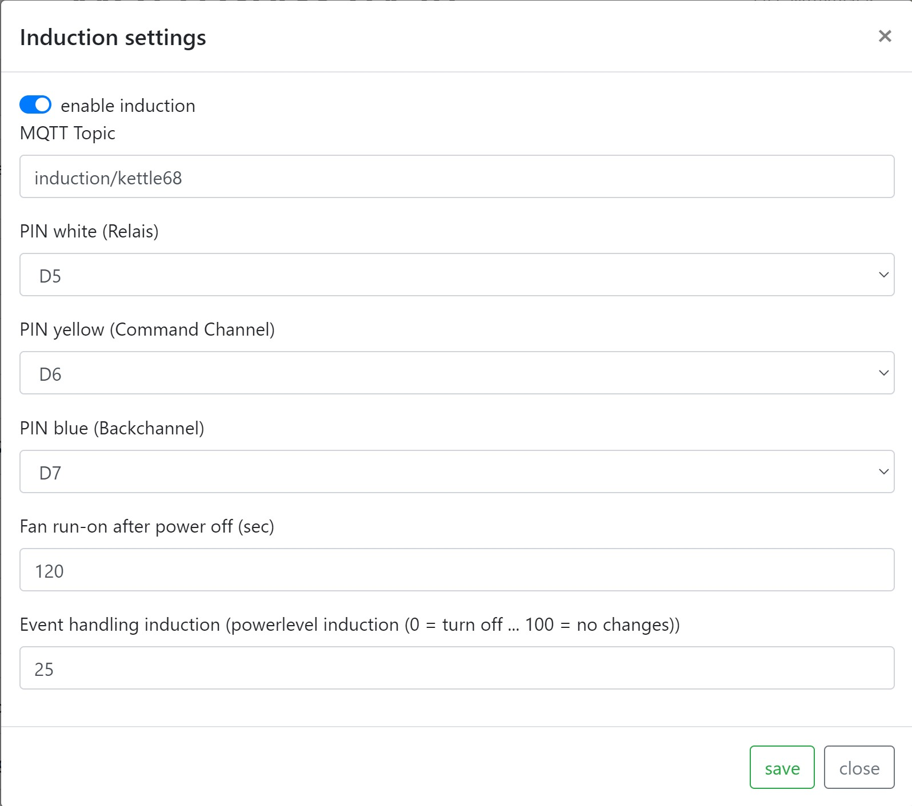

The picture above is an example on how to configure an induction hob GGM IDS2. Do not reduce fan run on after power off below 120sec: savely cool down induction hob after mash or boil. GPIOs D5, D6 and D7 are highly recommended. Check ESP8266 manual for further information about GPIO states (High/Low) on startup.

**Updates:**

The firmware offers two options for installing updates very easily.

1. Firmware Update file upload

    Call up the URL <http://mqttdevice/update> in the web browser or use the "Update" -> "Upload" button in the WebIf.
    Firmware and the LittleFS file system can be updated here. If the file system LittleFS is updated with file upload, the configuration file is overwritten. See backup and restore.

2. WebUpdate

    Open the webfront of your MQTTDevice in your web browser and call the "Update" -> "WebUpdate" function.
    WebUpdate updates the firmware, the index file and certificates. The configuration file is not overwritten by WebUpdate.

The WebUpdate can take a few minutes, depending on your internet connection. The web interface is not available during the web update. If only a very slow internet connection is available, the message "Browser not responding" is displayed after approx. 60 seconds. Please wait and let the WebUpdate run through.

WebUpdate Changed

Version 4.30 and up WebUpdate is divided into firmware and tools update. In most cases only firmware update is needed. CSS, fonts and js files are updated via tools.

**Backup and Restore:**

The file explorer can be reached via the web browser <http://mqttdevice/edit>

1. Backup

   Click on the file config.txt (left mouse button) and select download from the popup.

2. Restore

    Click on Select file, select the config.txt from the backup and click on upload

**Supported and tested hardware:**

Hardware (02.2022)

| Anzahl | Link |
| ------------ | ---- |
| ESP8266 D1 Mini | <https://www.amazon.de/dp/B01N9RXGHY/ref=cm_sw_em_r_mt_dp_0KzyFbK6YG2BE> |
| Relais Board 4 Kanal | <https://www.amazon.de/dp/B078Q8S9S9/ref=cm_sw_em_r_mt_dp_PHzyFbSR1PKCH> |
| Relais Board 1 Kanal | <https://www.amazon.de/dp/B07CNR7K9B/ref=cm_sw_em_r_mt_dp_FIzyFbKXXYE0H> |
| Nextion Display 3.5" | <https://www.amazon.de/dp/B07SSG86VC/ref=cm_sw_em_r_mt_dp_5Q2FNPMRRV25G4TPW68A> |
| Nextion Display 3.5" | <https://www.amazon.de/dp/B091YL88ZL/ref=cm_sw_em_r_mt_dp_R158FR0XZSWVWAKMZD62> |
| Piezo Buzzer | <https://www.amazon.de/dp/B07DPR4BTN/ref=cm_sw_em_r_mt_dp_aKzyFbJ0ZVK67> |

*The links to amazon are purely informative as a search aid*
*to be understood by well-known providers in germany*

---

## Using the firmware

Most of the functions of the firmware are self-explanatory. The addition or deletion of sensors and actors is therefore not described here.

**Main functions:**

    * Adding, editing and deleting sensors
    * Auto reconnect MQTT
    * Auto reconnect WiFi
    * Optional configure HMI touchdisplay
    * Inverted GPIO
    * Firmware and LittleFS updates via file upload
    * Firmware WebUpdate
    * Filebrowser for simple file management (e.g. backup and restore config.json)
    * DS18B20 temperature offset: easy calibration of the sensors

**Sensor calibration:**

Note: sensor calibration is an optional task. A two-point calibrtation is recommended espacially for mash tune sensors.

The firmware provides an easy option for sensor calibration. Three options availble:

    * no calibration
    
    leave deflaut value 0.0 (zero) for offset 1 and offset 2 (eg do nothing)
    
    * single point calibration or constant offset: enter a value for constant offset to offset 1 and set offset 2 to 0.0 (zero)

    The difference in a single temperture measure is your constant offset 1. There is no predeefined temperature for a single point measure.

    * two-point calibration: you need to measure at two predefined temperatures two offsets

A two point calibration provides a more accurate correction of each sensor by re-scaling it at two poinst instad of just one (constant offset). All you need is your mash tune, a calibrated temperature sensor and a cbpi4 mash profil, which includes two mash steps: at 40°C (low mashin temperature) and at 78°C (mashout temperature). Set both mash step timers to something lik 3 to 5 minutes. Fill your mash tune with water. If possible turn on agitator. Now start the two step mash profile in CraftbeerPi4. When temperatur 40°C is reached measure the temperature with a calibrated sensor. The difference between sensor value and calibrated temperatur sensor is offset 1. Repeat measurement when 78°C is reached. The difference is offset 2. In a two-point calibration it is very important to do the first measure at exactly 40°C and the second measure at exactly 78°C!

Calibration example:
Measurement
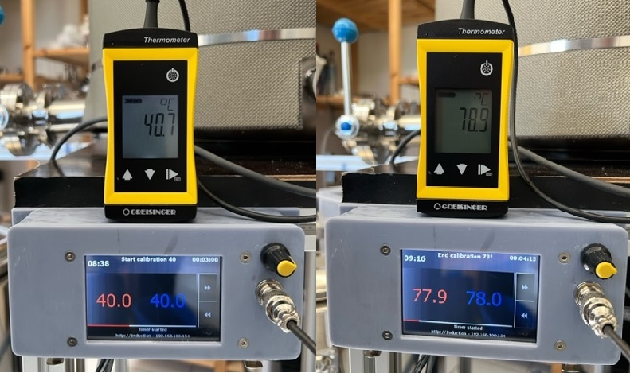

Sensor setting
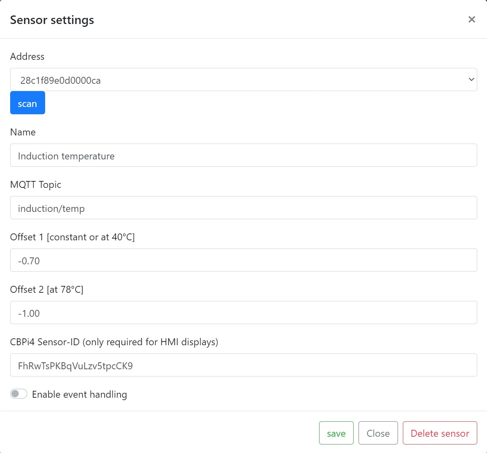

**Misc settings:**

1. System

    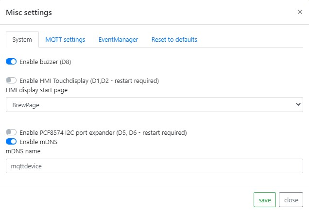

    **Piezo Buzzer:**

    A piezo buzzer can only be connected to PIN D8. A piezo buzzer is optional. The firmware supports 4 different signals: ON, OFF, OK and ERROR

    **HMI display:**

    If you want to use a display check jumper settings J1 and J2 first. GPIOs D1 and D2 are used for TX and RX.

    **mDNS:**

    A mDNS name can be used instead of the IP address of the ESP8266 in the web browser (<http://mDNSname>). The name is freely selectable. The mDNS name must be unique in local network and must not contain any spaces or special characters. Please note: if you use two or more MQTTDevices you must change default mDNS "mqttdevice" into an unique identifier!
    Reboot your mqttdevice after changing mDNS.

2. MQTT Settings

    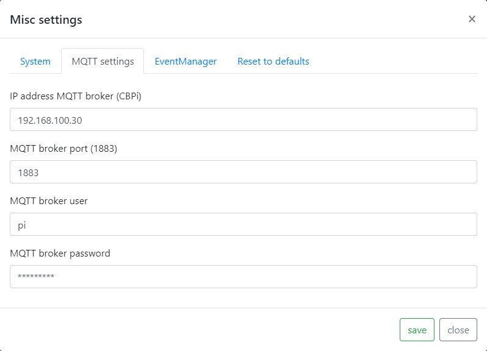

    **IP address MQTT Server (CBPi):**

    On this page you have to enter IP address, Port and credentials of your MQTT broker. In most cases, this is likely to be mosquitto on the CBPi. The default port is 1883.
    Important: the firmware MQTTDevice tries constantly to establish a connection with the MQTT broker. If the MQTT broker is not available, this will severely affect the speed of the MQTT device (web interface).

    New configuration parameter: Disable MQTT (brew without CBPi4)
    If enabled MQTT communication is disabled. Disabled MQTT is requiered for brewing without CBPi4.

3. Event manager

    The event manager handles events and misconduct. Handling of malfunctions (event handling) is deactivated in the standard setting!

    Events are
    * communication with the MQTT server is interrupted
    * Suddenly no temperature data is supplied from sensor

    Without event handling, the MQTTDevice doesn't do anything automatically. All actor states remain unchanged.

    The first thing that will takes place in a misconduct is a delay. Default delay is 120 seconds. Delays are configured for MQTT errors, sensor errors and actors. All actor states remain unchanged during the delay. While WLAN or MQTT communication is interrupted the MQTTDevice tries every 20 seconds to reconnect, regardless of any event handling setting. A successful reconnect will stop a started event delay.
    The delays are configured in misc settings in tab EventManager:

    1. Delay in MQTT errors
    2. Delay for the induction hob before a failed sensor triggers an event
    3. Delay for actors before a failed sensor triggers an event

    Standard delay is 120 seconds. After the delay, the MQTTdevice can change the status of the actors and induction hob. While actors like heating or cooling element, pumps or agitator can be switched off the induction hob can be set to a (lower) powerlevel, e.g. to 25% power to hold mash temperture while temperature sensor is in error state.
    MQTT event handling can generally be activated or deactivated. If MQTT event handling is activated, event handling must also be activated in each sensor and actor settings and for the induction hob. Each device can be configured individually.

    Every sensor also has an event handling property. If event handling is activated for a sensor, this sensor can start event handling when sensor connection is lost or sensor state changes into error. A sensor that is deactivated for event handling can not start event handling.

    An event handling example:

    * Misc settings in tab EventManager: Event handling enabled with default delay 120sec

    * Event handling temperature sensor in mash tune is enabled

    * Induction hob event handling is enabled and event powerlevel is set to 25%

    * Agitator actor event handling is disabled

    This easy example prevents the mash kettle from uncontrolled heating, when MQTT connection drops or DS18B20 sensor suddenly reports device unplugged.

4. PIDmanager

    PID controller configuration page. For best results autoTune should find optimale PID values Kp, Ki and Kd. Keep in mind: brewing without CBPi requires MQTT disabled (see MQTTsettings!).
    Run Autotune only with a normale average amount of water in your kettle. The value AutoTune setpoint is a target temperature. AutoTune setpointshould be minimum 10 better 20 degrees above actual water temperature in your kettle. If done enable chekcbox "Start PID autotune now". Switch to webpage mash and press the power button. Autotune takes approx 5min. PID values are saved automatically.

    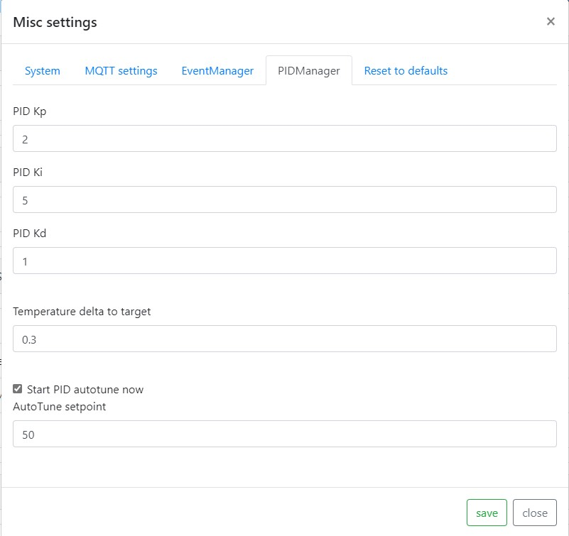

    Temperature delta to target is a defined gap beetween measured temperature and mash step target temperature. Within this gap next mash step will start. The main taks of this parameter is to shorten the delay due to PID calculations in the last tenth of degrees before reaching target (slope of the temperature graph flats down).
    Example:
    Target temperature: 64°C
    Temperature delta to target: 0.3
    Mash step will be started, when measured temperature reaches 63.7°C

---

## Brewing without CBPi

Brewing without CraftbeerPi as simpel as possible. This modes requires disabled MQTT. See misc settings.

Main features of this half automatic mash control are:

* Import recipes from kbh2, MMum and MQTTDevice files
* Export mash scheme to file download

Table mash scheme:

* column name: mash step name
* column temperature: define the mash step target temprature
* column duratiuon: define the mash step timer
* column autonext: define start next mash step automatically when timer ends
* edit mash scheme in a table. Each line is a mash step
* column actions: add, edit or delete a mash step eg. a line
* column actions: move a mash step up or down

Buttons:

* Power: On / Off brewing
* Play: starts the timer regardless the gap between measured and target temperature
* Play: will change to red, when autonext is disabled. While waiting on click GGM IDS2 turns off.
* Pause: will change to red, when mash step is paused. While pausing actual temperature is kept.
* Skip forward: skip to next mash step

actors:
Configured actors are listed with a simple on/off button.

---

## Touchdisplay

This firmware supports Nextion Touchdisplay HMI TFT 3.5" NX4832T035 (basic series), NX4832K035 (enhanced series) an NX4832F035 (discovery series). Three pages are availible:

Mode BrewPage: max 4 CBPi kettles overview

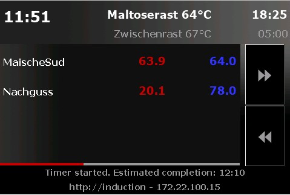

Mode KettlePage: current and target temperature

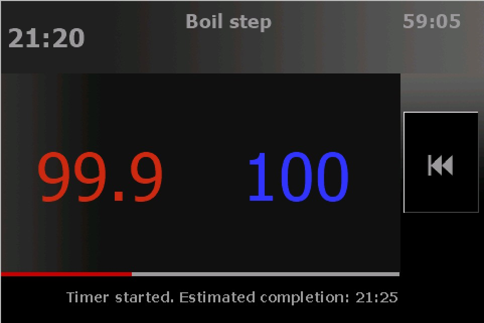

Attention: you must enter sensors IDs from CraftbeerPi4 in the sensor configuration page. Otherwise displayed tempertures may be wrong or mixed up between different sensors.

InductionPage: manual induction hob controller

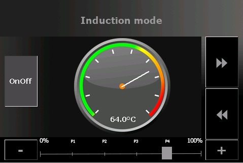

BrewPage is usefull while brewing. When your mash process completed the use of BrewPage (overview) ends. The Kettlepage can be used any time as a kettle temperature information pannel. The induction mode can be usefull beside automated brew. Instead the InductionPage offers manual control of your induction cooker. The display can be configured via the WebIf. While display is activated, GPIO D1 (SDL) and D2 (SDA) are in use (software serial tx/rx).

Files naming:
MQTTDevice4-Display_\<displaysize\>

Please note: github repository also provide 2,8" Display files. These files are shared by MQTTDevice users. These files are untested - i do not have other displays than 3.5".

**Instructions to flash NextionsX2 touchdisplay:**

Copy the file info/mqttdevice4-\<displaytype>.tft in the root directory of your SD card. Put your SD card into the cardreader of your Nextion display and power on. The MQTTDevice display template will be flashed. When finished power off and remove SD card.

**Connect NextionsX2 touchdisplay:**

Please check the manual of your display first! Use this information on your own risk!

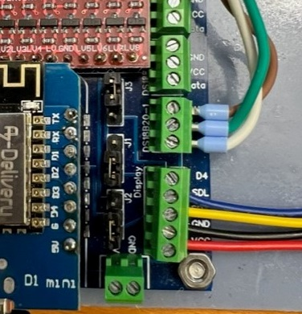

Nextion red cable power+ plugged into screw terminal display port Vcc

Nextion black cable power- plugged into screw terminal display port GND

Nextion blue cable TX plugged into screw terminal display port D1 (SDL)

Nextion yellow cable RX plugged into screw terminal display port D2 (SDA)

---

## MQTTDevice circuit board

**Important note:**

The circuit board was created from a hobby project. A fully assembled board is not offered. The project has no commercial intent. The information shared here represents a state of development and is used for further development as well as for checking, correcting and improving. Content from external links (e.g. hobby brewer forum) and information on external content (e.g. articles from well-known providers) are subject to the respective rights of the owner. External content is to be viewed solely as an informative start-up aid.

*All information about the board is purely informative and may be incorrect.*
*Use this information at your own risk. Any liability is excluded.*

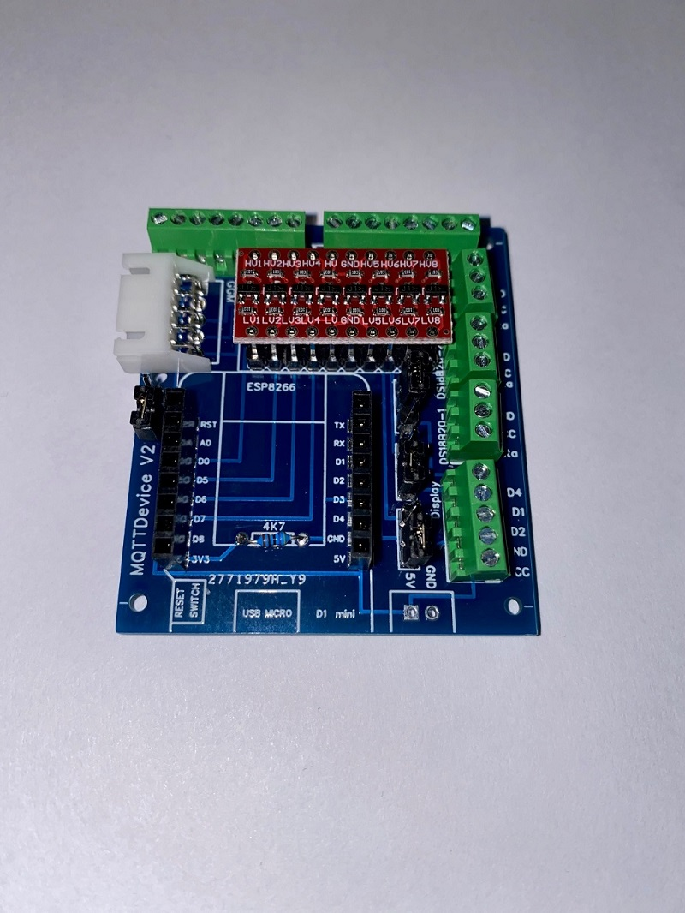 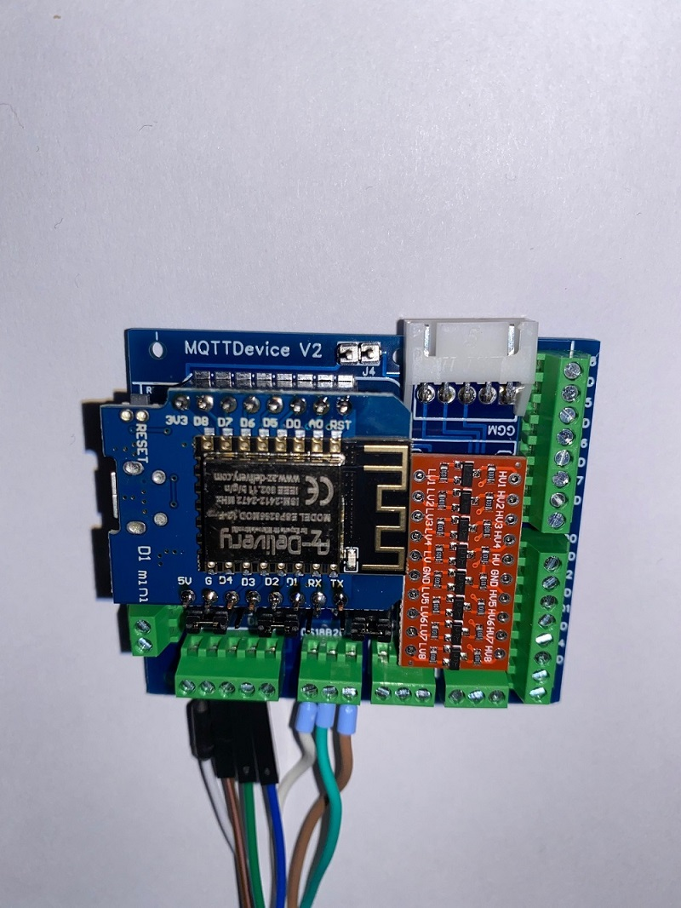

In this project, a circuit board for the MQTT device was developed in order to offer a simple connection to sensors, actors and the induction hob GGM IDS2 with clamping screw blocks. The board is equipped with only a few components. The board offers the following advantages:

* the Wemos D1 mini is on a base and can be removed at any time.
* all GPIOs are led to screw terminals.
* A LevelShifter provides 5V control voltage to the screw terminals GPIOs (Logic Level Converter).
* The power supply from the Wemos can be used directly from the induction hob when using a GGM IDS2.
* Temperature sensors DS18B20 fixed to D3 can be connected directly to the screw terminals.
* An optional Touchdisplay HMI TFT can be connected using jumpers J1 and J2 via D1 (SDL) and D2 (SDA J2).
* PIN D4 can either be routed to the display port via jumper J3 or to D4 via the LevelShifter.
* PIN D8 is routed to D8 (3V3) without LevelShifter.
* Power supply 5V via screw terminal

**Jumper settings:**

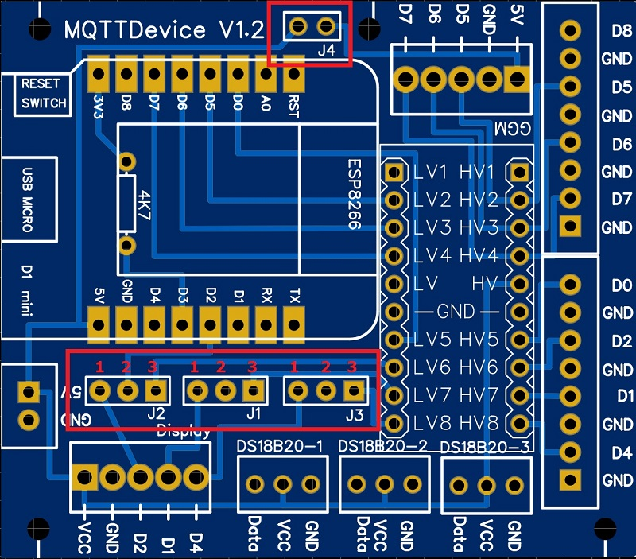

There are 4 jumpers on the board:

1. Jumper J1: PIN D1
    1. In position 1-2, D1 is led to the display connection (SDL)
    2. In position 2-3, D1 is led to connection D1 via the LevelShifter

2. Jumper J2: PIN D2
    1. In position 1-2, D2 is led to the display connection (SDA)
    2. In position 2-3, D2 is led to connection D2 via the LevelShifter

3. Jumper J3: PIN D4
    1. In position 1-2, D4 is led to the display connection as D4, if necessary for a TFT
    2. In position 2-3, D4 is led to connection D4 via the LevelShifter

4. Jumper J4: 5V power connection GGM IDS2
    1. If the jumper is bridged, the 5V power supply from the induction hob (JST-HX socket) is used
    2. If the jumper is not set, the Wemos needs a power supply via the 5V connection
    Jumper J4 is optional. If the GGM IDS2 is not used, the jumper and connection socket can be omitted.

    *If the power supply is drawn from the induction hob (jumper J4 set), no additional voltage supply may be connected via the 5V input.*
    *GPIO0, GPIO2 and GPIO15 map the boot mode for the Wemos D1 Mini. GPIO15 is not connected via the LevelShifter and must be set to low for Flash Boot Mode. GPIO0 and GPIO2 are on high during flash boot*

* Layout circuit board:**

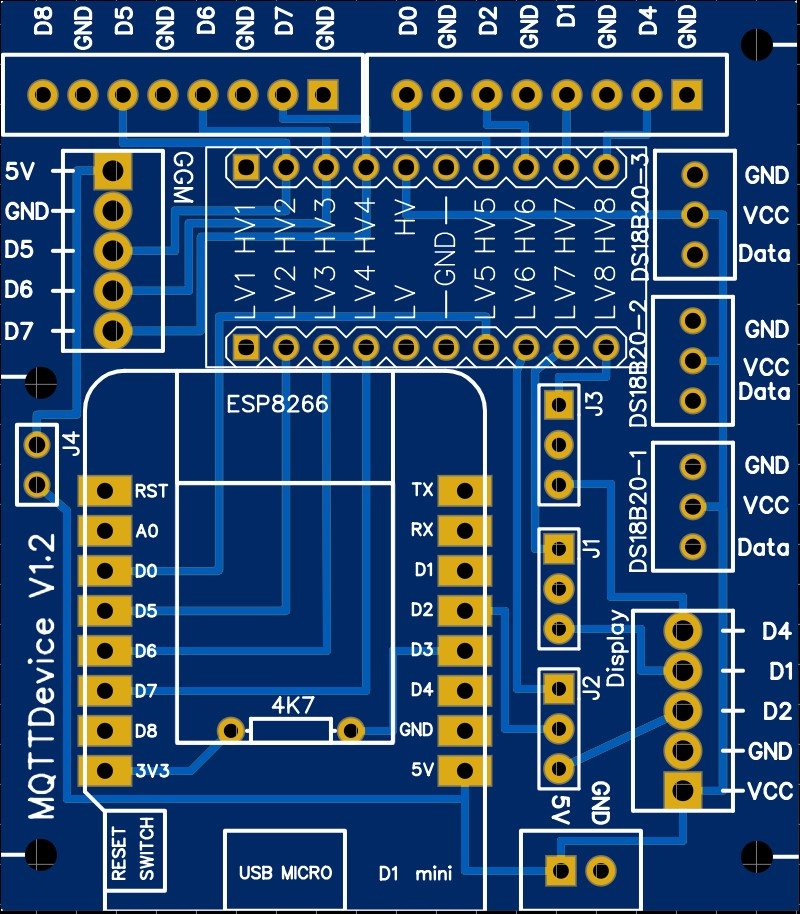

In the Info folder there is an EasyEDA file that can be used to create the circuit board. STL files for a 3D print MQTTDevice housing are also located in the Info folder.
Please share corrections, improvements and further developments.

**Circuit board parts list:**

The following components are required:

| Anzahl | Artikel | ArtikelNr |
| ------ | ------- | --------- |
| 1 | screw terminal block 2pol 2,54 | (eg voelkner S84366) |
| 3 | screw terminal block 3pol 2,54 | (eg voelkner S84893) |
| 2 | screw terminal block 5pol 2,54 | (eg voelkner S84806) |
| 2 | screw terminal block 8pol 2,54 | (eg voelkner S84611) |
| 1 | JST-HX connector 90° 2,54 | (eg voelkner D17526) |
| 1 | Header single row 2,54 | (eg voelkner D19990) |
| 4 | Jumper 2,54 | (eg voelkner S655251) |
| 1 | Resistor 4,7kOhm | (eg voelkner S620751) |
| 1 | D1 mini NodeMcu ESP8266-12E | (eg amazon ASIN B01N9RXGHY) |
| 1 | LevelShifter 8 Channel 5V 3.3V | (eg amazon ASIN B01MZ76GN5) |

*amazon and voelkner are purely informative as a search aid*
*to be understood by well-known providers (in germany)*

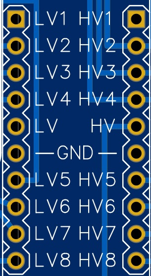

When selecting LevelShifter (Logic Level Converter), the assignment must be observed! The LevelShifter must have this order in the Low Voltage (LV) input:

`LV1 - LV2 - LV3 - LV4 - LV (3V3) - Ground - LV5 - LV6 - LV7 - LV8`

**Notes on construction:**

The resistor R 4.7kOhm for the temperature sensors DS18B20 is placed under the Wemos D1 mini. Therefore the Wemos has to be socketed. The sockets also offer the advantage that the Wemos can be removed from the circuit board at any time, e.g. for flashing or testing. The DS18B20 are supplied with 5V at VCC. This ensures a stable supply even with longer supply lines. The resistance is from Data (PIN D3) to 3V3. The JST-HX socket and the J4 jumper for the induction hob are optional.

## Connection of induction hob

*The following description deletes the guarantee claims for the induction hob*
*Use this manual at your own risk*

The GGM IDS2 induction hob can **optionally** be connected to the circuit board. The GGM IDS2 is supplied with an external control unit. When the control panel is opened, the cable connection from the control panel to the induction hob can be removed. All you have to do is pull the cable out of the socket in the control panel.
The exact same socket (JST-HX) is located on the MQTTDevice board.

The connections must be configured via the web interface as follows:

* White (relay) is permanently connected to PIN D7
* Yellow (Command Channel) is permanently connected to pin D6
* Blue (back channel) is permanently connected to pin D5

A separate power supply is not required for the MQTT device when using the GGM IDS2.

## Connecting sensors DS18B20

Temperature sensors of type DS18B20 with 3 connection cables (data, VCC and GND) are supported. Temperature sensors are tied to D3. The necessary resistance 4k7 to 3V3 is provided on the board. The voltage supply for the temperature sensors is connected to 5V.

## Connecting relais boards

In addition to a GPIO, relay boards require a 5V power supply. 5V can be tapped at one of the three connections for the temperature sensors DS18B20 at VCC and GND.

---

## Case 3D print

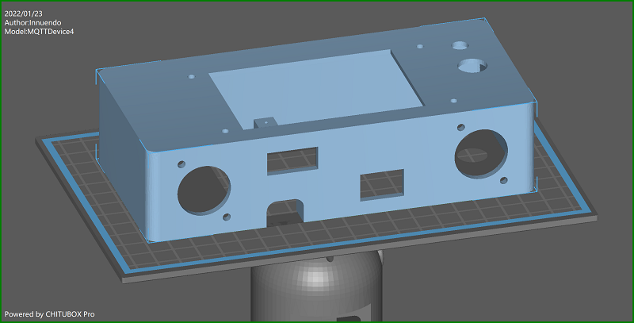
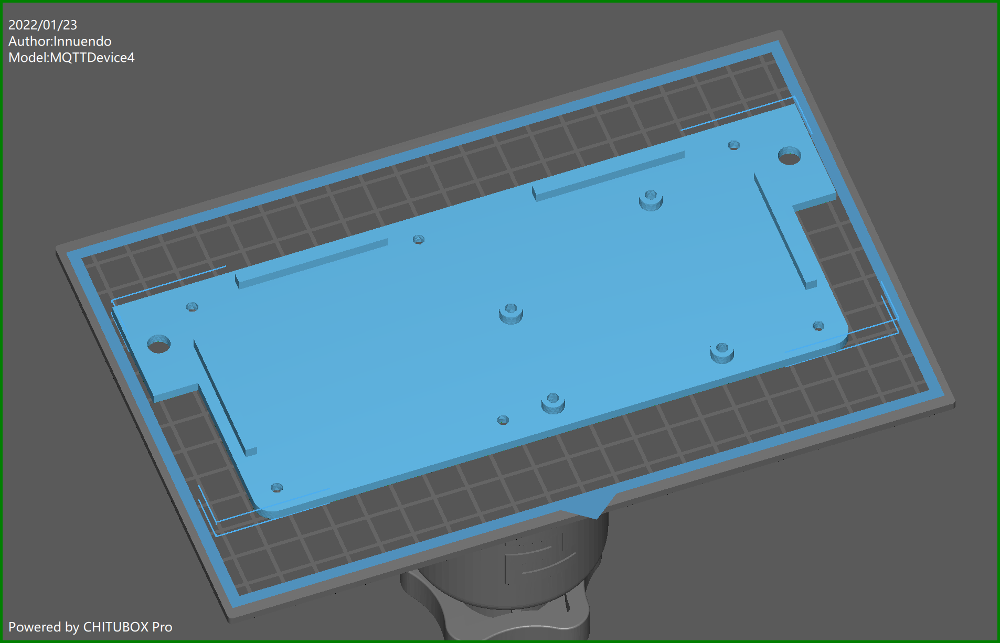

3D print files are located in the info folder. With the current housing design, the circuit board and a 3.5" Nextion touchdisplay are glued into the housing. Holes for housing, base and circuit board are made with a diameter for M3 screws. M3x10mm screws fit for display, circuit board and XLR connectors. M3x16 screws match for groundplate to case holes and pads. You need to cut M3 threads into the six pads. Both objects are build parameterized with FreeCAD. Improvments are welcome!

A friendly user from german hobbybrauerforum send me STL and HMI files for 2,8" displays. thx!
Files nameing:

MQTTDevice4-Base_\<displaysize\>
MQTTDevice4-Case_\<displaysize\>

A mash kettle example:

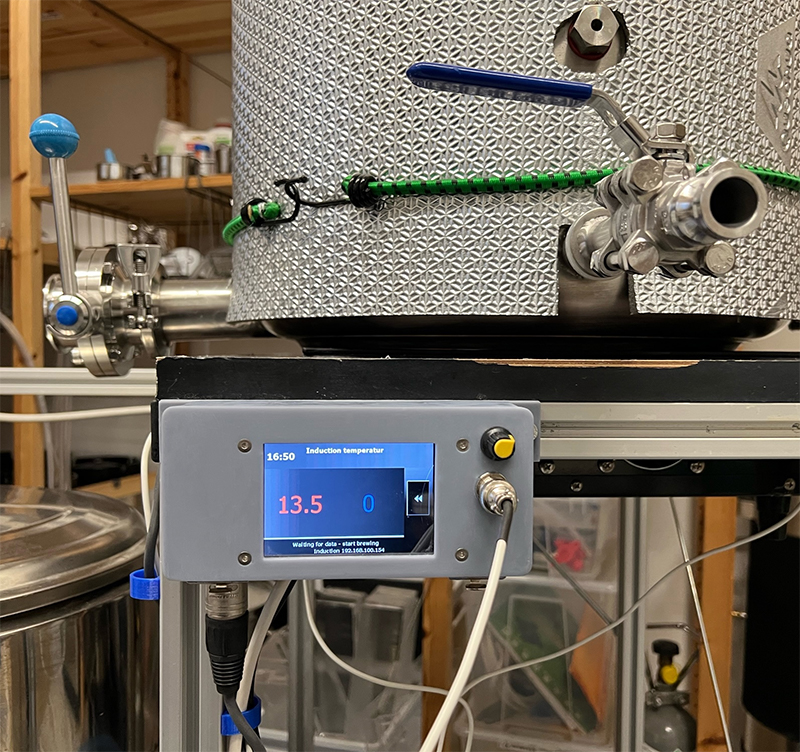

GPIOs D5, D6 and D7 are used by induction hob GGM IDS2. A buzzer is connected to GPIO D8. GPIO D1 and D2 are bound to display. GPIO D4 is used to handle an agitator. The yellow knob is a PWM modul. The connector below shows the cable to the agitator. This MQTTDevice is connected with a 6 cores cable: two lines for 5V power MQTTDevice. Another two lines are used for 24V agitator power, conected to the PWM modul IN. And the last two lines ares used by GPIO D4 + GND and connected to a SSR to switch on/off the agitator power adapter (24V). The PWM modul OUT is connected to the agitator. Both power adapters (MQTTDevice and agitator) are installed on a DIN rail in a central swtich cabinet.

---
